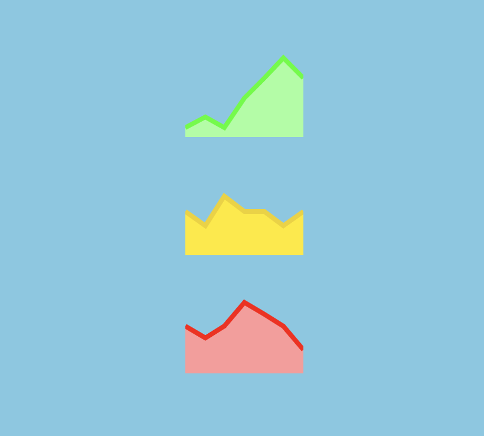

<h1 align="center">
  <a href="https://www.npmjs.com/package/@react-sandbox/sparkline">@react-sandbox/sparkline</a>
</h1>

<p align="center">
  
</p>

<p align="center">📈 Sparkline SVG component.</p>

## Usage

### Install

Install the `@react-sandbox/sparkline` package:

```
npm install @react-sandbox/sparkline
```

### Import

Import the `Sparkline` component:

```tsx
import React from 'react'
import Sparkline from '@react-sandbox/sparkline'

function App() {
  return (
    <div>
      <Sparkline
        values={[1, 2, 1, 4, 6, 8, 6, 7]}
        width={50}
        height={50}
        foo={bar}
      />
    </div>
  )
}
```

### Props

| Prop          | Type                  | Default      | Description       |
| ------------- | --------------------- | ------------ | ----------------- |
| `values`      | `Array<number>`       | **required** | Values to plot    |
| `width`       | `number \| string`    | **required** | Sparkline width   |
| `height`      | `number \| string`    | **required** | Sparkline height  |
| `lineColor`   | `string`              | `'#123456'`  | Stroke color      |
| `lineWidth`   | `number \| string`    | `1`          | Stroke width      |
| `fillColor`   | `string`              | `'#123456'`  | Fill area color   |
| `fillOpacity` | `number \| string`    | `1`          | Fill area opacity |
| `className`   | `string`              | `-`          | CSS classes       |
| `style`       | `React.CSSProperties` | `-`          | CSS styles        |

## Development

### Local

```
pnpm install
pnpm dev
```

### Tests

```
pnpm test
```

### Example

Inside `test/`:

```
pnpm install
pnpm dev
```

## License

MIT
