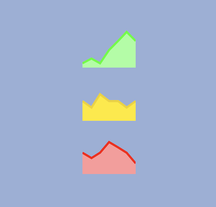

<h1 align="center">
  <a href="https://www.npmjs.com/package/@react-sandbox/sparkline">@react-sandbox/sparkline</a>
</h1>

<p align="center">
  
</p>

<p align="center">📈 Sparkline SVG component.</p>

## Usage

### Install

Install the `@react-sandbox/sparkline` package:

```
npm install @react-sandbox/sparkline
```

### Import

Import the `Sparkline` component:

```tsx
import React from 'react'
import Sparkline from '@react-sandbox/sparkline'

function App() {
  return (
    <div>
      <Sparkline
        values={[1, 2, 1, 4, 6, 8, 6]}
        width={50}
        height={50}
      />
    </div>
  )
}
```

### Props

| Prop          | Type                  | Default      | Description            |
| ------------- | --------------------- | ------------ | ---------------------- |
| `values`      | `Array<number>`       | **required** | Y-coordinates on graph |
| `width`       | `number`              | **required** | Sparkline width        |
| `height`      | `number`              | **required** | Sparkline height       |
| `lineColor`   | `string`              | `'#4989eb'`  | Line stroke color      |
| `lineWidth`   | `number`              | `3`          | Line stroke width      |
| `fillColor`   | `string`              | `'#b2cff2'`  | Fill area color        |
| `fillOpacity` | `number`              | `1`          | Fill area opacity      |
| `className`   | `string`              | `-`          | CSS classes            |
| `style`       | `React.CSSProperties` | `-`          | CSS styles             |

## Development

### Local

```
pnpm install
pnpm dev
```

### Tests

```
pnpm test
```

### Example

Inside `test/`:

```
pnpm install
pnpm dev
```

## License

MIT
